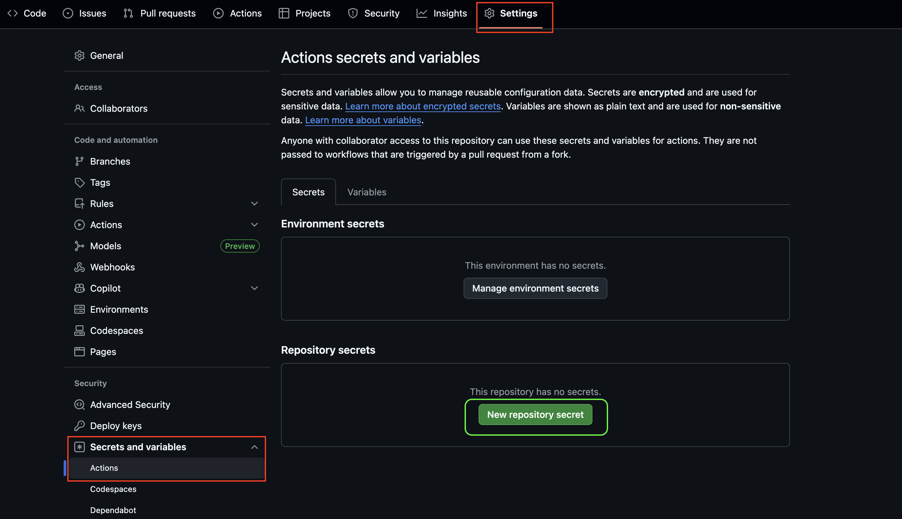
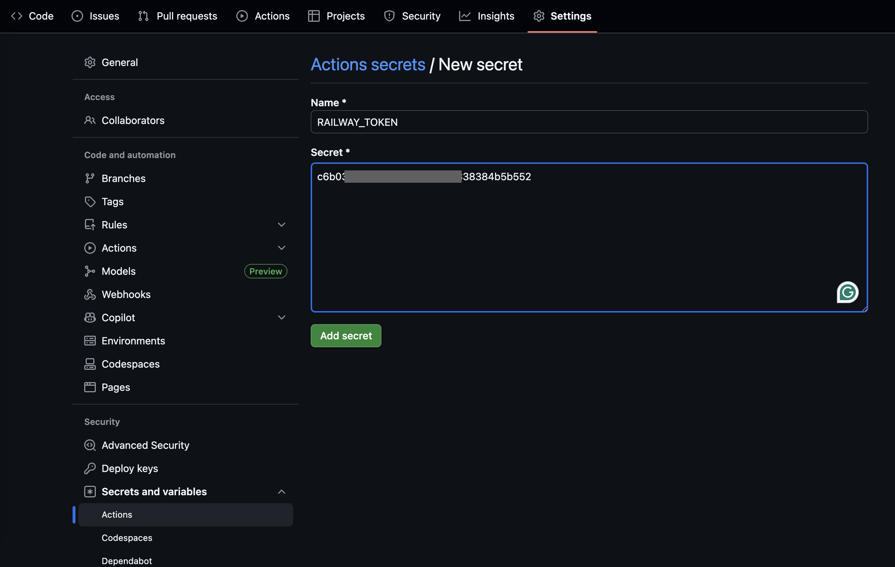

# 🔐 GitHub Secrets Configuration Guide

> **Essential guide for setting up secrets in GitHub Actions for secure CI/CD deployment with Docker**

## 📋 Table of Contents

- [🎯 Overview](#-overview)
- [🔑 Required Secrets for Java Docker App](#-required-secrets-for-java-docker-app)
- [📖 Step-by-Step Setup Guide](#-step-by-step-setup-guide)
- [🐳 How to Get Your Docker Hub Credentials](#-how-to-get-your-docker-hub-credentials)
- [🚂 How to Get Your RAILWAY_TOKEN](#-how-to-get-your-railway_token)
- [🔒 Security Best Practices](#-security-best-practices)
- [🔧 Troubleshooting](#-troubleshooting)
- [✅ Verification](#-verification)

---

## 🎯 Overview

GitHub Secrets allow you to store sensitive information like API keys, tokens, and passwords securely in your repository. These secrets are encrypted and only accessible to your GitHub Actions workflows during execution.

**Why Use Secrets?**
- ✅ Keep sensitive data out of your code
- ✅ Encrypted and secure storage
- ✅ Only accessible during workflow execution
- ✅ Easy to update without changing code

---

## 🔑 Required Secrets for Java Docker App

For the Java application CI/CD pipeline with Docker, you need:

| Secret Name | Purpose | Where to Get It |
|-------------|---------|-----------------|
| `DOCKER_USERNAME` | Login to Docker Hub | Docker Hub Account |
| `DOCKER_PASSWORD` | Authenticate with Docker Hub | Docker Hub Access Token |
| `RAILWAY_TOKEN` | Deploy to Railway platform | Railway Dashboard |

---

## 📖 Step-by-Step Setup Guide

### Step 1: Navigate to Repository Settings

1. **Open your GitHub repository** in a web browser
2. **Click the "Settings" tab** (located at the top-right of the repository page)
3. **In the left sidebar**, scroll down and click **"Secrets and variables"**
4. **Select "Actions"** from the dropdown menu



### Step 2: Add New Repository Secret

1. **Click the "New repository secret" button** (green button on the right)
2. **Enter the secret name** exactly as specified (case-sensitive!)
3. **Enter the secret value** (your actual token/password)
4. **Click "Add secret"** to save



### Step 3: Repeat for All Required Secrets

Complete Step 2 for each secret listed in the [Required Secrets](#-required-secrets-for-javascript-app) section.

---

## 🐳 How to Get Your Docker Hub Credentials

### Prerequisites

1. **Create Docker Hub Account** (if you don't have one)
   - Go to [hub.docker.com](https://hub.docker.com)
   - Click "Sign up" and create your account
   - Verify your email address

### Getting Your Docker Username

Your `DOCKER_USERNAME` is simply your Docker Hub username (the one you use to login).

**Example:** If you login to Docker Hub as `john_doe`, then:
- **Secret Name**: `DOCKER_USERNAME`
- **Secret Value**: `john_doe`

### Getting Your Docker Access Token (Recommended)

**⚠️ Important:** Use an Access Token instead of your password for better security!

1. **Login to Docker Hub**
   - Go to [hub.docker.com](https://hub.docker.com)
   - Sign in with your credentials

2. **Navigate to Security Settings**
   - Click on your **username** (top-right corner)
   - Select **"Account Settings"**
   - Click **"Security"** in the left sidebar

3. **Create New Access Token**
   - Click **"New Access Token"**
   - **Token description**: "GitHub Actions CI/CD"
   - **Access permissions**: Select "Read, Write, Delete" (or as needed)
   - Click **"Generate"**

4. **Copy the Token**
   - **Copy the generated token immediately** (you won't see it again!)
   - This token will be your `DOCKER_PASSWORD` value

5. **Add to GitHub Secrets**
   - **Secret Name**: `DOCKER_PASSWORD`
   - **Secret Value**: The access token you just copied

### Alternative: Using Your Docker Password

If you prefer to use your actual password (not recommended):
- **Secret Name**: `DOCKER_PASSWORD`
- **Secret Value**: Your Docker Hub login password

**⚠️ Security Note:** Access tokens are more secure because they can be revoked individually and have limited scope.

---

## 🚂 How to Get Your RAILWAY_TOKEN

### Method 1: Through Railway Dashboard (Recommended)

1. **Login to Railway**
   - Go to [railway.app](https://railway.app)
   - Sign in with your account

2. **Access Account Settings**
   - Click on your **profile picture** (top-right corner)
   - Select **"Account Settings"** from the dropdown

3. **Navigate to Tokens Section**
   - In the left sidebar, click **"Tokens"**
   - You'll see the API tokens management page

4. **Create New Token**
   - Click **"Create Token"** button
   - Give it a descriptive name (e.g., "GitHub Actions Docker Deploy")
   - **Copy the generated token immediately** (you won't see it again!)

5. **Add to GitHub Secrets**
   - Go back to your GitHub repository settings
   - Add a new secret with:
     - **Name**: `RAILWAY_TOKEN`
     - **Value**: The token you just copied

### Method 2: Through Railway CLI

```bash
# Login to Railway (if not already logged in)
railway login

# List your tokens (optional - to see existing tokens)
railway tokens

# The token is automatically stored locally after login
# You can find it in your Railway config files
```

**Note:** The CLI method stores the token locally, but you'll still need to manually copy it to GitHub Secrets.

---

## 🔒 Security Best Practices

### ✅ Do's

- **Use Docker Hub Access Tokens** instead of passwords
- **Use descriptive names** for your tokens (e.g., "GitHub Actions Deployment")
- **Set expiration dates** when possible
- **Regularly rotate tokens** (every 3-6 months)
- **Use the principle of least privilege** (minimal required permissions)
- **Keep secrets at the repository level** unless needed organization-wide

### ❌ Don'ts

- **Never commit secrets to your code** (even in comments)
- **Don't share secrets** in chat or email
- **Don't use the same credentials** across multiple projects
- **Don't ignore security warnings** from GitHub or Docker Hub
- **Don't use secrets in pull request workflows** from forks

### 🔍 Secret Naming Conventions

Follow these patterns for consistency:

```
PLATFORM_PURPOSE
```

Examples:
- `DOCKER_USERNAME` (not `docker_username` or `Docker-Username`)
- `DOCKER_PASSWORD` (not `dockerPassword`)
- `RAILWAY_TOKEN` (not `railway_token`)

---

## 🔧 Troubleshooting

### Common Issues and Solutions

#### ❌ "Login failed" during Docker Hub authentication

**Possible Causes:**
- Incorrect username or password/token
- Token has insufficient permissions
- Docker Hub account issues

**Solutions:**
1. **Verify credentials** are correct in GitHub Secrets
2. **Regenerate Docker Hub access token** with proper permissions
3. **Check Docker Hub account status** (not suspended/limited)
4. **Test login locally**:
   ```bash
   echo $DOCKER_PASSWORD | docker login -u $DOCKER_USERNAME --password-stdin
   ```

#### ❌ "Authentication failed" during Railway deployment

**Possible Causes:**
- Invalid or expired Railway token
- Incorrect secret name (case-sensitive!)
- Token doesn't have required permissions

**Solutions:**
1. **Verify secret name** matches exactly: `RAILWAY_TOKEN`
2. **Regenerate token** in Railway dashboard
3. **Update secret value** in GitHub with new token
4. **Check token permissions** in Railway

#### ❌ "Docker push failed" or "unauthorized" errors

**Possible Causes:**
- Docker Hub repository doesn't exist
- Insufficient permissions to push to repository
- Rate limiting from Docker Hub

**Solutions:**
1. **Create repository** on Docker Hub first:
   - Go to Docker Hub → Repositories → Create Repository
   - Make it public for easier access
2. **Verify repository name** in workflow matches Docker Hub repo
3. **Check Docker Hub plan limits** (pulls/pushes per hour)

#### ❌ "railway up" command hangs in containerized deployment

**Possible Causes:**
- Railway trying to detect build method
- Container startup issues
- Network timeouts

**Solutions:**
1. **Use specific Railway configuration**:
   ```bash
   railway up --detach --service=your-service-name
   ```
2. **Check railway.toml** configuration file
3. **Add healthcheck** to your Docker container
4. **Monitor Railway logs** for detailed error messages

#### ❌ Node.js setup fails in deployment job

**Possible Causes:**
- Missing Node.js setup action
- Wrong Node.js version specified

**Solutions:**
1. **Ensure Node.js setup** in Job 3:
   ```yaml
   - uses: actions/setup-node@v4
     with:
       node-version: '18'
   ```
2. **Use LTS version** of Node.js for stability

---

## ✅ Verification

### Verify Your Setup

1. **Check Secret Creation**
   - Go to repository Settings → Secrets and variables → Actions
   - Confirm all three secrets appear in the list:
     - ✅ `DOCKER_USERNAME`
     - ✅ `DOCKER_PASSWORD`
     - ✅ `RAILWAY_TOKEN`
   - You should see "Updated X minutes ago" for each

2. **Test Secret Access in Workflow**
   Add this temporary step to your workflow for testing:
   ```yaml
   - name: Test secret access
     run: |
       echo "Testing secret availability..."
       if [ -z "${{ secrets.DOCKER_USERNAME }}" ]; then
         echo "❌ DOCKER_USERNAME not found"
         exit 1
       fi
       if [ -z "${{ secrets.DOCKER_PASSWORD }}" ]; then
         echo "❌ DOCKER_PASSWORD not found"
         exit 1
       fi
       if [ -z "${{ secrets.RAILWAY_TOKEN }}" ]; then
         echo "❌ RAILWAY_TOKEN not found"
         exit 1
       fi
       echo "✅ All secrets are accessible"
   ```

3. **Test Docker Hub Authentication**
   ```yaml
   - name: Test Docker Hub login
     run: |
       echo ${{ secrets.DOCKER_PASSWORD }} | docker login -u ${{ secrets.DOCKER_USERNAME }} --password-stdin
       echo "✅ Docker Hub authentication successful"
   ```

4. **Run a Test Deployment**
   - Push a small change to trigger the workflow
   - Monitor the Actions tab for successful execution
   - Check Docker Hub for your pushed image
   - Check Railway dashboard for successful deployment

### Security Audit Checklist

- [ ] All secrets use strong, unique values
- [ ] Using Docker Hub access tokens (not passwords)
- [ ] Secret names follow naming conventions
- [ ] No secrets are committed to code
- [ ] Tokens have appropriate expiration dates
- [ ] Only necessary people have repository admin access
- [ ] Regular token rotation schedule is established
- [ ] Docker Hub repository exists and is accessible
- [ ] Railway project is properly configured

---

## 📚 Additional Resources

- [GitHub Actions Secrets Documentation](https://docs.github.com/en/actions/security-guides/encrypted-secrets)
- [Docker Hub Access Tokens Guide](https://docs.docker.com/docker-hub/access-tokens/)
- [Railway CLI Documentation](https://docs.railway.app/develop/cli)
- [Railway API Tokens Guide](https://docs.railway.app/reference/api-reference)
- [CI/CD Security Best Practices](https://docs.github.com/en/actions/security-guides)

---

## 🆘 Need Help?

If you encounter issues not covered in this guide:

1. **Check the workflow logs** in the Actions tab for detailed error messages
2. **Review Docker Hub activity** and rate limits
3. **Check Railway deployment logs** in the Railway dashboard
4. **Consult the course documentation** or ask your instructor
5. **Verify all prerequisites** are met (accounts created, proper permissions)

---

**Happy Deploying! 🚀**

> Remember: Security is everyone's responsibility. Keep your secrets safe and follow best practices!
